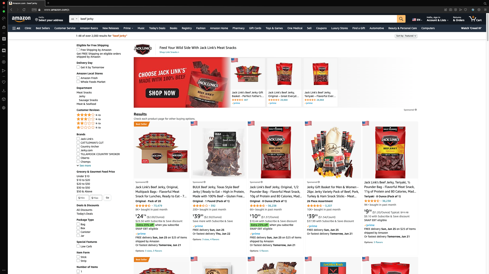

<div align="center">
  <br>
 
  <br>
  <h2>
    Made In <br>
    Browser Extension
    <br>
  </h2>
</div>

<p align="center">A cross-platform web browser extension that shows the country of origin on product for popular websites</p>
<hr />

<div align="center" >
  <a href="https://github.com/luis-c465/made-in/actions">
    
  </a>
    &nbsp;
  <a>
    
  </a>
    &nbsp;
  <a href="https://github.com/luis-c465/made-in/blob/main/LICENSE">
    
  </a>

</div>

- [Features](#features)
- [Browser Support](#browser-support)
- [Quick Start](#quick-start)
  - [Clone the repo](#clone-the-repo)
  - [Running the extension](#running-the-extension)
  - [Available Commands](#available-commands)
- [Contributing](#contributing)

## Features

- Support for Amazon search results page
  

[^1]: While it is fully supported and stable in most cases, hard reloading is rarely recommended.

## Browser Support

| [](/) | [](/) | [](/) | [](/) | [](/) |
| --------------------------------------------------------------------------------------------- | ------------------------------------------------------------------------------------------------ | --------------------------------------------------------------------------------------- | ------------------------------------------------------------------------------------------ | ------------------------------------------------------------------------------------------ |
| ✔                                                                                            | ✔ (Beta)                                                                                        | ✔                                                                                      | ✔                                                                                         | ✔                                                                                         |

## Quick Start

Ensure you have

- [Node.js](https://nodejs.org/en/download) 16 or later installed
- [Pnpm](https://pnpm.io/installation) installed

### Clone the repo

```bash
git clone https://github.com/luis-c465/made-in.git
```

### Running the extension

- `pnpm install` to install dependencies.
- `pnpm run dev` to start the development server.
- `pnpm run build` to build an unpacked extension.

- **Load extension in Chrome (Chromium, Manifest V3)**

  - Go to the browser address bar and type `chrome://extensions`
  - Check the `Developer Mode` button to enable it.
  - Click on the `Load Unpacked Extension` button.
  - Select your `dist` folder in the project root.

- **Load extension in Firefox (Manifest V2)**

  - Go to the browser address bar and type `about://debugger`
  - Click on the `Load Temporary Add-on` button.
  - Select your `dist-firefox-v2` folder in the project root.

### Available Commands

- `pnpm run clean` to remove dist folder. `dev` and `build` commands call this command.
- `pnpm run format` to fix code with eslint and prettier.
- `pnpm run lint` to call ESLint and Prettier.

## Contributing

Contributions are always welcome!

See [CONTRIBUTING.md](./CONTRIBUTING.md) for ways to get started.

This repository is following the [Conventional Commits](https://www.conventionalcommits.org/en/v1.0.0/) standard.
